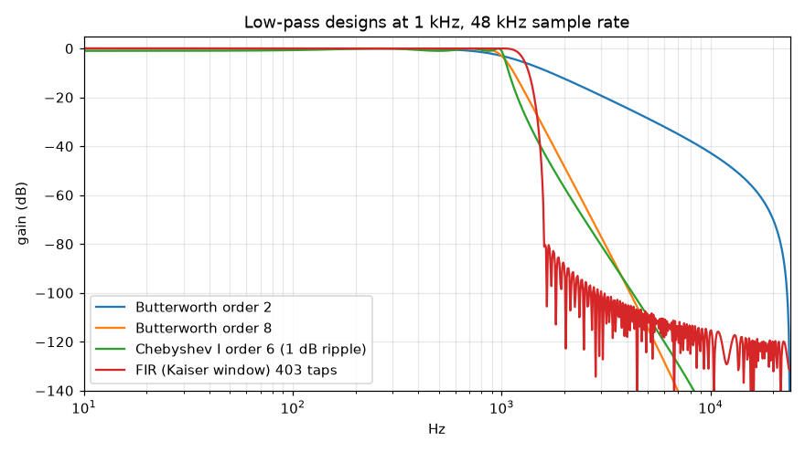
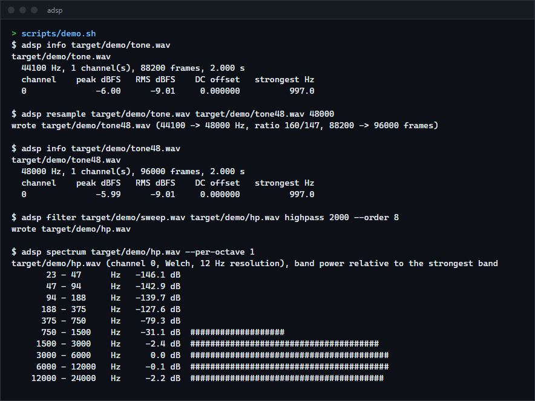
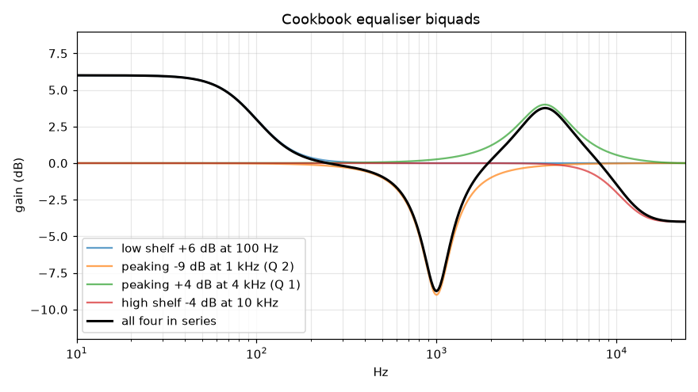
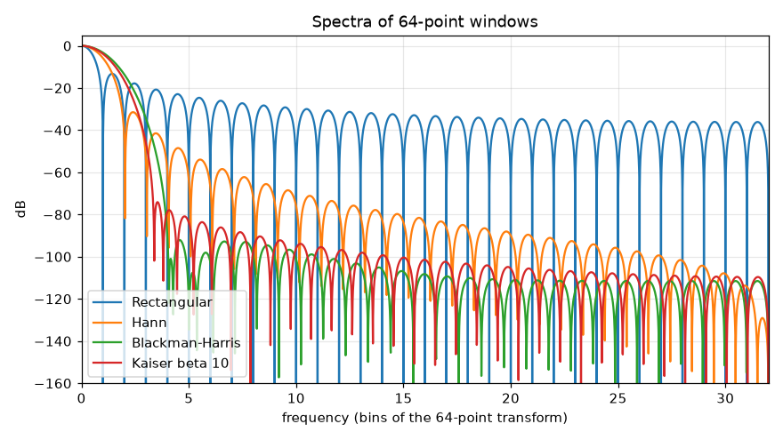

# adsp

Audio DSP building blocks in Rust with no dependencies: an FFT for any length, window functions, FIR and IIR filter design, convolution, a polyphase resampler, dynamics (compressor, look-ahead limiter) and WAV files, plus an `adsp` command that applies them to WAV files. Every design function is checked against NumPy and SciPy on the same inputs. For anyone who needs these pieces in a Rust program, or wants to read how they work.

**Status:** v0.1.0, working on Windows. The library and the command are compile-checked for Linux (musl), not run there. Not published to crates.io.



## What is in it

| Module | Contents | Checked against |
|---|---|---|
| `fft` | Complex FFT of any length: radix-2, mixed radix for lengths whose prime factors are all 13 or less (44,100, 48,000), Bluestein for the rest. Real-input FFT and its inverse. | `numpy.fft.fft` |
| `window` | Hann, Hamming, Blackman, Blackman-Harris, Nuttall, flat-top, Bartlett, Kaiser; symmetric and periodic forms; coherent gain and ENBW. | `scipy.signal.get_window` |
| `fir` | Windowed-sinc design with SciPy's band layout and scaling, the Kaiser design rule, a streaming filter, direct, FFT and streaming overlap-add convolution. | `scipy.signal.firwin`, `numpy.convolve` |
| `iir` | The eight Audio EQ Cookbook biquads; Butterworth and Chebyshev type I designs of any order (low, high, band-pass, band-stop) as second-order sections. | `scipy.signal.butter`, `cheby1`, `sosfilt`, `sosfreqz`, `lfilter` |
| `resample` | Rational-ratio polyphase resampler that reproduces `scipy.signal.resample_poly` and also runs on a stream; linear and cubic interpolation for comparison. | `scipy.signal.resample_poly` |
| `dynamics` | Peak, RMS, normalisation, fades, a soft-knee compressor, a look-ahead limiter whose ceiling is guaranteed, a DC blocker. | properties (see Verification) |
| `spectrum` | Welch's power spectral density, Goertzel, peak frequency to a fraction of a bin. | `scipy.signal.welch` |
| `signal`, `wav` | Test signals (sine, exponential sweep, noise); WAV reading (PCM 8 to 32 bit, float, extensible header) and writing. | round trips, hand-made files |

All arithmetic is `f64`.

## How to install

Requires a recent stable Rust (built and tested with 1.98.1).

```sh
git clone https://github.com/r3clusionn/audio-dsp-library
cd audio-dsp-library
cargo install --path .          # the adsp command
```

As a library, use it as a git dependency: `adsp = { git = "https://github.com/r3clusionn/audio-dsp-library" }`. The library itself has no dependencies; the command uses `clap`.

## How to use

```rust
use adsp::iir::{butter, Band, Biquad};
use adsp::resample::Resampler;
use adsp::spectrum::peak_frequency;

let mut x = adsp::signal::sine(44_100, 1000.0, 44_100.0, 0.5);
let mut lp = butter(4, Band::Lowpass(5000.0), 44_100.0).unwrap(); // 4th order, as sections
lp.process_block(&mut x);
let mut eq = Biquad::peaking(3000.0, 1.0, 4.0, 44_100.0);         // +4 dB bell at 3 kHz
eq.process_block(&mut x);
let y = Resampler::between(44_100, 48_000).run(&x);                // 160/147, as resample_poly
assert!((peak_frequency(&y, 48_000.0) - 1000.0).abs() < 0.5);
```

The command:

```sh
adsp gen tone.wav sine --freq 997 --seconds 2 --rate 44100   # sine, sweep or noise
adsp info tone.wav                                           # levels, DC, strongest frequency
adsp resample tone.wav tone48.wav 48000
adsp filter in.wav out.wav highpass 2000 --order 8           # Butterworth
adsp filter in.wav out.wav lowpass 4000 --fir 255            # linear-phase FIR instead
adsp filter in.wav out.wav peaking 3000 --gain 4 --q 1       # also low-shelf, high-shelf, notch
adsp gain in.wav out.wav --limit -1                          # or --normalize -1, --compress -20 --ratio 4
adsp spectrum in.wav --per-octave 3                          # Welch spectrum as a bar chart
adsp response lowpass 1000 --order 4                         # a filter's gain and phase, no audio
```

Output files are 24-bit PCM unless `--format 16` or `--format f32` is given.







The three plots are the library's own output (`cargo run --release --example responses`), drawn by `scripts/plots.py`.

## Benchmarks

Windows 11, Intel Core i9-14900KF, Rust 1.98.1, release build with LTO (`cargo run --release --example bench`). Median of 7 timings, each repeating the operation for about 50 ms. `rustfft` 6 is planned once outside the timed loop, as `adsp` is.

| FFT length | adsp algorithm | adsp | rustfft | adsp is slower by |
|---|---|---|---|---|
| 1,024 | radix-2 | 5.6 us | 1.3 us | 4.2x |
| 4,096 | radix-2 | 30.2 us | 9.4 us | 3.2x |
| 65,536 | radix-2 | 721 us | 198 us | 3.6x |
| 1,048,576 | radix-2 | 29.8 ms | 6.6 ms | 4.5x |
| 44,100 | mixed radix | 1.25 ms | 144 us | 8.7x |
| 48,000 | mixed radix | 713 us | 164 us | 4.4x |
| 1,009 (prime) | Bluestein | 27.6 us | 5.3 us | 5.2x |
| 65,537 (prime) | Bluestein | 8.1 ms | 616 us | 13.2x |

`rustfft` is 3 to 13 times faster: it uses SIMD and larger radixes; `adsp`'s transforms are plain scalar code written to be read. A real-input FFT of 65,536 points takes 644 us.

One second of 48 kHz audio, mono:

| Operation | adsp | Faster than real time |
|---|---|---|
| FIR, 255 taps, one sample at a time | 3.59 ms | 279x |
| FIR, 255 taps, overlap-add with 256-sample blocks | 837 us | 1,195x |
| Convolution with a 1-second impulse response, overlap-add, 4,096-sample blocks | 19.1 ms | 52x |
| The same convolution as one FFT | 5.17 ms | 193x |
| One biquad | 115 us | 8,672x |
| Butterworth, order 8 (4 sections) | 493 us | 2,028x |
| Resampling 44.1 to 48 kHz | 1.65 ms | 607x |
| Welch spectrum of 10 seconds, 4,096-point segments | 5.03 ms | 1,989x |

For context, the same operations in NumPy 2.5.3 and SciPy 1.18.1 on the same machine (`scripts/bench_scipy.py`; each call includes Python's overhead of a few microseconds):

| Operation | NumPy / SciPy | adsp |
|---|---|---|
| FFT 1,024 / 65,536 / 44,100 | 8.6 us / 880 us / 397 us | 5.6 us / 721 us / 1.25 ms |
| FIR 255 taps (`lfilter`), 1 s | 1.06 ms | 3.59 ms (overlap-add: 0.84 ms) |
| Convolution with a 1 s response (`fftconvolve`) | 2.33 ms | 5.17 ms |
| Butterworth order 8 (`sosfilt`), 1 s | 224 us | 493 us |
| `resample_poly` 160/147, 1 s | 618 us | 1.65 ms |
| `welch`, 10 s | 11.1 ms | 5.03 ms |

SciPy's compiled routines are 2 to 3 times faster for filtering, convolution and resampling; `adsp` is faster for Welch and for small FFTs, where Python's call overhead dominates.

## Verification

70 tests: 56 unit tests, 8 comparisons with NumPy and SciPy, 5 tests of the command and 1 doctest (`cargo test --release`).

- **Against NumPy and SciPy.** `scripts/make_fixtures.py` stores inputs and what NumPy 2.5.3 and SciPy 1.18.1 compute from them in `tests/fixtures/scipy.json`. The tests require: FFTs of 22 lengths (all three algorithms) equal to 1e-13 of the largest bin; windows to 1e-14; `firwin` designs (low, high, band, multi-band, five windows) coefficient for coefficient to 1e-13; Butterworth and Chebyshev filters of orders 1 to 12 in all four band types, both their response at 8 frequencies and their output on 600 samples of noise, to 1e-9; cookbook biquads against an independent transcription of the cookbook run through `lfilter`, to 1e-12; `resample_poly` at 7 ratios sample for sample to 1e-13; `welch` to 1e-12.
- **The resampler's quality is SciPy's.** Converting a 1 kHz tone from 44.1 to 48 kHz gives a signal-to-noise ratio of 63.95 dB with the default filter (Kaiser window, beta 5), the same as SciPy to 12 digits; with beta 10, 107.4 dB, as in SciPy. Downsampling a 20 kHz tone by 2 leaves less than -40 dB at the alias frequency, where linear interpolation leaves most of it.
- **The streaming forms equal the one-shot forms.** The streaming resampler and the overlap-add convolver give exactly the one-shot output for every chunking tried, from one sample at a time up.
- **Properties.** Every FFT length from 0 to 200 against the direct DFT; tones of exactly known spectrum at lengths up to 1,048,576 and at primes; Parseval, linearity, the shift theorem, round trips. Butterworth: -3.01 dB at the cutoff and 6 dB per octave per order for orders 1 to 12; order 40 stays stable. Chebyshev: the ripple reaches but never exceeds its bound. The limiter never exceeds its ceiling on 200,000 samples of bursts up to +26 dB and single-sample spikes. WAV parsing survives every truncation of a valid file.
- **Mutation checks**: 44 deliberate breakages (twiddle signs, butterfly rotations, a missing bit reversal, a Bluestein kernel not mirrored, window coefficients, filter scaling, pre-warping, bilinear rate, resampler alignment, Welch scaling, the limiter's window, WAV sign extension and chunk padding). All 44 are caught. The first run caught 43: nothing tested a filter that is unstable only through its `a1` coefficient, so that test was added.

Process notes: the first plots were made while the mutation run had a broken source file in place, and two plots had legends shifted by commas in series names; all were regenerated from clean source and checked by eye. Two of my own test expectations were wrong (a -6 dB level that is really -6.02 dB, and an SNR target above what the SciPy design can reach); the code was right in both cases.

## How it works

- **FFT.** Powers of two use an iterative radix-2 transform with bit reversal and a contiguous twiddle table per stage. Other lengths with small prime factors use recursive decimation in time with dedicated radix-2, 3, 4 and 5 butterflies and a generic one for 7, 11 and 13. Any other length uses Bluestein's algorithm: multiplying by a chirp turns the transform into a convolution, done with power-of-two FFTs of at least `2n - 1` points. The real-input FFT packs even and odd samples into one complex transform of half the length and separates them afterwards.
- **IIR design.** The analog prototype's poles (Butterworth or Chebyshev), a frequency transformation to the requested band, the bilinear transform with the cutoffs pre-warped so they land exactly where asked, then the poles and zeros are paired into second-order sections, nearest zeros to each pole pair, the gain on the first section.
- **Resampler.** The input is conceptually upsampled by `up`, filtered, and every `down`-th sample kept; the polyphase form computes only the kept samples from the input samples that contribute. The filter, padding and trimming follow `resample_poly` so the output aligns with it exactly.
- **Limiter.** The gain each sample needs is held at its minimum over the look-ahead window and then averaged over the same window. Each value in the average is at most what the delayed sample needs, so the output cannot exceed the ceiling, while the gain still moves smoothly.

## Limits

- The FFT is 3 to 13 times slower than `rustfft` and about 2 to 3 times slower than SciPy's compiled filtering and resampling (see Benchmarks). There is no SIMD.
- Overlap-add uses one FFT size for the whole filter, so very long filters are slow (a 1-second response runs 52 times real time); a partitioned convolver would fix that.
- IIR design covers Butterworth and Chebyshev type I only: no Chebyshev type II, elliptic or Bessel.
- Everything is `f64`; there is no `f32` path.
- The compressor's level detector is a per-sample peak in decibels with attack and release smoothing; there is no RMS detector, side chain or stereo linking.
- WAV only. No MP3, FLAC or other formats, no compressed WAV (ADPCM), no 64-bit RF64 files. The command processes whole files in memory.
- Only Windows was run.

## License

MIT (see `LICENSE`).
